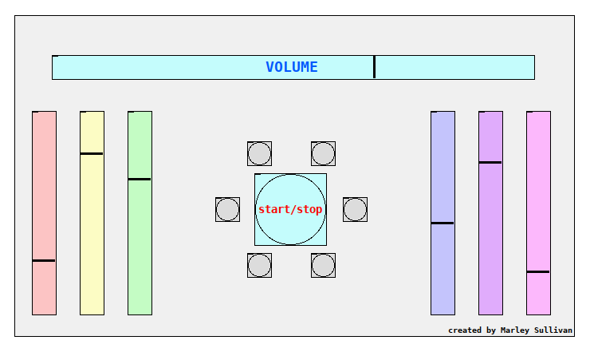

# Procedural generation program for *Digital Sea*

## About
Digital Sea is an ambient, generative music piece written in the Pure Data programming language. It is constantly changing, circulating, and flowing.

The algorithms used to generate the piece rely on randomness, so every run is unique and can produce infinite lengths of sound that never exactly repeat. You can listen to a unique, endless performance of *Digital Sea* by running this software on your own computer. You can even alter it by interacting with the buttons and sliders on the interface.

## How to install/run:

1. Make sure you have [Pure Data](https://puredata.info/ "Pure Data official website") installed. It's a free & open-source program available for Linux, Mac, and Windows.
2. Open Pure Data. Make sure the DSP is checkmarked 'on'.
3. Open `main.pd` in Pure Data.

#### Note:
- Make sure Pure Data is NOT in "Edit Mode" (`Edit > Edit Mode`, or `Ctrl+e`). If you're in Edit Mode, you won't be able to interact with the program apart from dragging it around.
- Once the program is running, make sure you press the start button and turn up the volume. Headphones are recommended.
- The unlabelled buttons and sliders do things -- feel free to play around with them, or leave them at their default settings.
